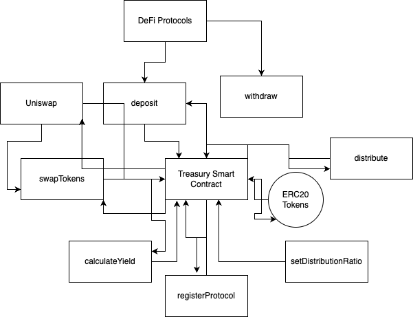
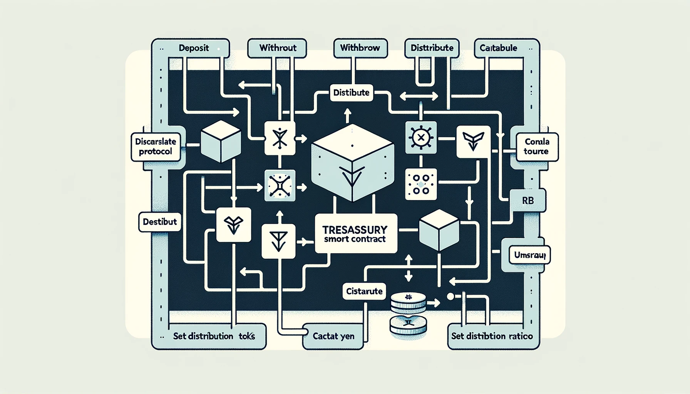

# Treasury Smart Contract Documentation

## Introduction
This document provides an overview of the Treasury Smart Contract, designed for decentralized finance (DeFi) interactions. The contract manages and automates interactions with various DeFi protocols and liquidity pools.

## Contract Overview
The Treasury contract is responsible for handling ERC20 tokens, distributing funds, swapping tokens, and aggregating yields. It serves as a central point for managing interactions with different DeFi protocols.

## Diagram
 
 using digrams.net

 using dall-e

## Key Functionalities

### Deposit Function (`deposit`)
- **Description**: Allows users to deposit ERC20 tokens into the Treasury.
- **Parameters**: 
  - `token`: Address of the token to deposit.
  - `amount`: Amount of the token to deposit.

### Protocol Registration (`registerProtocol`)
- **Description**: Enables the contract owner to register DeFi protocols for interaction.
- **Parameters**:
  - `protocol`: Address of the protocol.
  - `protocolInterface`: Interface of the protocol.

### Distribution Ratio Setting (`setDistributionRatio`)
- **Description**: Allows the owner to set fund distribution ratios for each protocol.
- **Parameters**:
  - `protocol`: Address of the protocol.
  - `ratio`: Distribution ratio for the protocol.

### Fund Distribution (`distribute`)
- **Description**: Distributes funds to registered protocols based on set ratios.
- **Parameters**:
  - `token`: Address of the token to be distributed.

### Fund Withdrawal (`withdraw`)
- **Description**: Withdraws funds from registered protocols.
- **Parameters**:
  - `protocol`: Address of the protocol.
  - `amount`: Amount to withdraw.

### Yield Calculation (`calculateYield`)
- **Description**: Calculates aggregated yield from all protocols.

### Token Swapping (`swapTokens`)
- **Description**: Swaps tokens via Uniswap.
- **Parameters**:
  - `tokenIn`: Address of the input token.
  - `tokenOut`: Address of the output token.
  - `amountIn`: Amount of the input token.
  - `amountOutMin`: Minimum amount of the output token.
  - `path`: Trading path for the swap.

## Integration with Uniswap
The contract integrates with Uniswap for token swapping, utilizing the `IUniswapV2Router02` interface. This allows the Treasury to execute token swaps as part of its fund management strategy.

## Security Aspects
TODO

## Testing and Security Audits
TODO

## Future Enhancements
TODO
